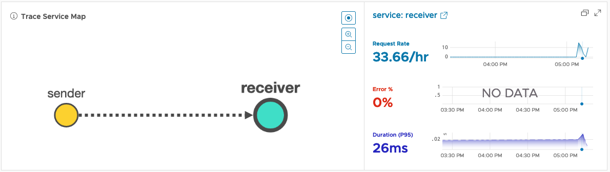

# Monitor Business Apps with OpenTelemetry and VMware Aria Operations for Applications (Wavefront)

A project which demonstrates usage of [OpenTelemetry K8S Operator](https://github.com/open-telemetry/opentelemetry-operator) and [VMware Aria Operations for Applications](https://www.vmware.com/products/aria-operations-for-applications.html) to monitor Application without modifing its source code.

> This is a Proof-of-Concept. OpenTelemetry Collector and Operator APIs are subjects to change. Use with caution!


The purpose is to gather "RED" metrics to monitor App health ([See Google SRE Book](https://sre.google/sre-book/monitoring-distributed-systems/#xref_monitoring_golden-signals)) and App traces to visualize app architecure and potential errors.

## How it works

1. OTel Operator injects **OTel Auto-Instrumentation** in Application Pod (sidecar)
2. **OTel Auto-Instrumentation** sends metrics and traces to Wavefront Proxy (OTL Protocol over gRPC or HTTP)
3. Wavefront Proxy with built-in **OTel Collector** capabilities buffers and sends metrics and traces to [VMware Aria Operations for Applications](https://www.vmware.com/products/aria-operations-for-applications.html) tenant.

## Installation
### Prerequisites
 - Kubernetes >= 1.19
 - VMware Aria Operations for Applications `API KEY` + `TENANT NAME` ([Get Trial Code](https://tanzu.vmware.com/observability-trial))

### Install Wavefront Proxy (OTel Collector Service)
Install Wavefront Proxy Collector which gather metrics from Kubernetes, deployed middleware and acts as OTel Collector Service.

The installation is done through our Operator

```shell
kubectl apply -f https://raw.githubusercontent.com/wavefrontHQ/wavefront-operator-for-kubernetes/v2.1.1/deploy/kubernetes/wavefront-operator.yaml
kubectl wait pods -l control-plane=controller-manager -n observability-system  --for=condition=Ready
```
Create a secret with your API KEY

```shell
export YOUR_WAVEFRONT_TOKEN=aaaaaa-bbbb-cccc-9ddddd7a-eeeeeee
kubectl create -n observability-system secret generic wavefront-secret --from-literal token=${YOUR_WAVEFRONT_TOKEN}
```

Then create a Wavefront CRD with the OTLP protocol activated and the proper URL to your tenant

```shell
kubectl apply -f - <<EOF
apiVersion: wavefront.com/v1alpha1
kind: Wavefront
metadata:
  name: wavefront
  namespace: observability-system
spec:
  clusterName: dbrice-gke
  wavefrontUrl: https://longboard.wavefront.com/
  dataCollection:
    metrics:
      enable: true
  dataExport:
    wavefrontProxy:
      enable: true
      oltp:
        grpcPort: 4317
        httpPort: 4318
        resourceAttrsOnMetricsIncluded: true
EOF
```

### Install cert-manager (prerequisite for OTel operator)
```shell
kubectl apply -f https://github.com/cert-manager/cert-manager/releases/download/v1.8.0/cert-manager.yaml
kubectl wait pods -l app=webhook -n cert-manager --for=condition=Ready
```

### Install opentelemetry-operator 
```shell
kubectl apply -f https://github.com/open-telemetry/opentelemetry-operator/releases/latest/download/opentelemetry-operator.yaml
kubectl wait pods -l control-plane=controller-manager -n opentelemetry-operator-system  --for=condition=Ready
```

## Create OpenTelemetry auto-instrumentation injection
This example deploys an OpenTelementry auto-instrumentation for **Java**, **Python** and **NodeJS**. [Others Languages in Roadmap](https://opentelemetry.io/docs/instrumentation/)

The endpoint is the wavefront-proxy service over gRPC port (4317)
```yaml
kubectl apply -f - <<EOF
apiVersion: opentelemetry.io/v1alpha1
kind: Instrumentation
metadata:
  name: my-instrumentation
spec:
  exporter:
    endpoint: http://wavefront-proxy.observability-system:4317
  propagators:
    - tracecontext
    - baggage
    - b3
  sampler:
    type: parentbased_traceidratio
EOF
```

## Demo with Spring App and RabbitMQ

The auto-instrument capability is used on a simple [Rabbit MQ Hello World](https://www.rabbitmq.com/tutorials/tutorial-one-spring-amqp.html) tutorial. The Java source code is not altered.

Thanks to OpenTelemetry the different message from *sender* to *receiver* via rabbitMQ are tracked with a unique ID and make possible to generate a visualization of the application architecture.

### Deploy Rabbit MQ
Deploy RabbitMQ from [Helm Chart provided by Bitnami](https://bitnami.com/stack/rabbitmq/helm)

*username* and *password* are soft-coded in the rabbitMQ tutorial.

```shell
helm repo add bitnami https://charts.bitnami.com/bitnami  && helm repo update

helm install rabbitserver bitnami/rabbitmq \
    --set persistence.enabled=false \
    --set metrics.enabled=true \
    --set auth.username=tutorial \
    --set auth.password=tutorial \
    --set nameOverride=rabbitserver
```

### Deploy the Java Apps
The Apps are deployed with the core K8S API (Pods, Deployments, Jobs, ...).

An **annotation** is added in order to trigger Auto-instrumentation.
> `instrumentation.opentelemetry.io/inject-java: "default/my-instrumentation"`

An **env** variable is added to make visualization nicer.
>```
> env:
> - name: OTEL_RESOURCE_ATTRIBUTES
>   value: "application=rabbitApp"
>```

```yaml
kubectl apply -f - <<EOF
apiVersion: v1
kind: Pod
metadata:
  labels:
    app: rabbitmq-tutorials
    run: sender
  name: sender
  annotations:
    instrumentation.opentelemetry.io/inject-java: "default/my-instrumentation"
spec:
  containers:
  - image: docker.io/bdekany/rabbitmq-tutorials:spring-amqp
    name: sender
    env:
    - name: OTEL_RESOURCE_ATTRIBUTES
      value: "application=rabbitApp"
    command: ["java"]
    args: ["-jar", "rabbitmq-tutorials.jar", "--spring.profiles.active=hello-world,sender,remote"]
  dnsPolicy: ClusterFirst
  restartPolicy: Always
---
apiVersion: v1
kind: Pod
metadata:
  labels:
    app: rabbitmq-tutorials
    run: receiver
  name: receiver
  annotations:
    instrumentation.opentelemetry.io/inject-java: "default/my-instrumentation"
spec:
  containers:
  - image: docker.io/bdekany/rabbitmq-tutorials:spring-amqp
    name: receiver
    env:
    - name: OTEL_RESOURCE_ATTRIBUTES
      value: "application=rabbitApp"
    command: ["java"]
    args: ["-jar", "rabbitmq-tutorials.jar", "--spring.profiles.active=hello-world,receiver,remote"]
  dnsPolicy: ClusterFirst
  restartPolicy: Always
EOF
```

## Build your own docker image
```shell
git clone https://github.com/rabbitmq/rabbitmq-tutorials
cd rabbitmq-tutorials/spring-amqp
cp ../../Dockerfile .
docker build .
```
